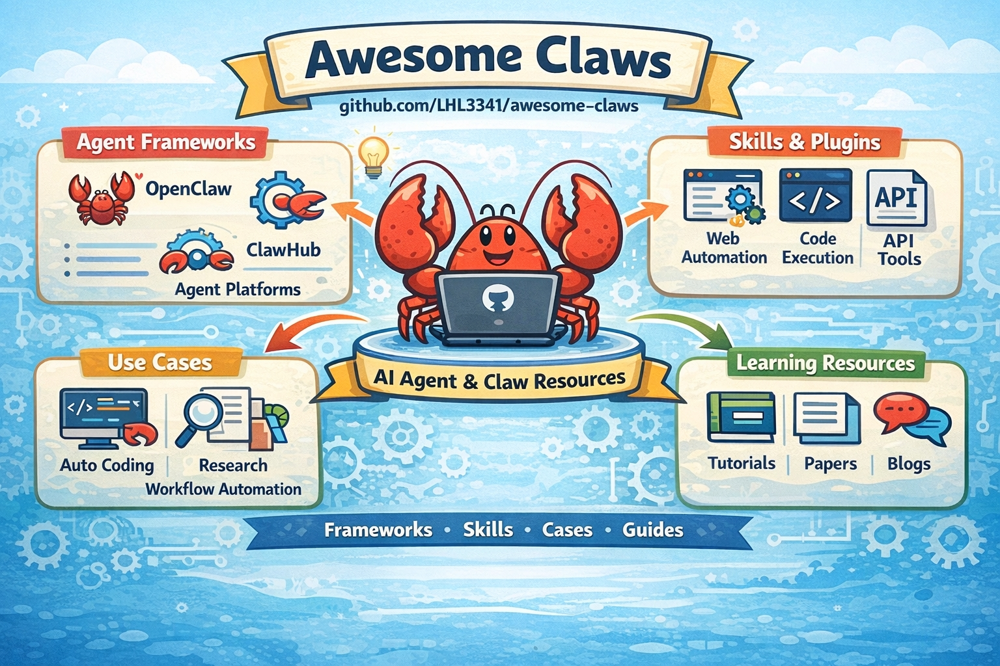

# OpenClaw 入门教程及项目集锦

[中文](./README.md) | [English](./README.en.md)

> OpenClaw 入门教程及项目集锦：按使用场景整理的产品、技能、社区与生态资源。

  

OpenClaw 所在的生态横跨：个人 AI 助手、学术研究工作流、编程开发产品、自动化平台、技能生态，以及 agent 社区。

这个列表聚焦于**用户可直接使用的产品与资源**，而不是底层实现细节。

如果你把 OpenClaw 看成一个项目，这个仓库做的事情就是：
**把围绕 OpenClaw 长出来的产品、技能、渠道、部署方案、研究工具和社区资源整理成一张可导航的地图。**

适合快速入门、找项目、看生态，也适合想做科研、自动化、coding agent、渠道接入或 skills 扩展的人。

这个仓库优先收录：
- 产品级、可直接使用的 OpenClaw 相关项目
- 技能、插件、渠道接入、部署与运维方案
- 与 OpenClaw 使用方式高度相关的研究 / 编程 / 自动化工具
- 高质量的社区目录、案例清单与生态导航资源

默认不重点收录：
- 纯底层 framework / infra 组件
- 与 OpenClaw 关系较弱的泛 AI 项目
- 信号太弱、文档不清、真实性不足的仓库
- 没有形成真实使用价值的演示型项目

第一次来，建议先看：**精选**、**个人助手**、**学术研究**、**编程开发**、**自动化**、**技能与注册表**、**部署与运维**。

## 精选

如果你想快速了解这个生态，可以先看下面这些代表项目。

- [**openclaw/openclaw**](https://github.com/openclaw/openclaw)   — 旗舰级个人 AI 助手。
- [**ValueCell-ai/ClawX**](https://github.com/ValueCell-ai/ClawX)   — 面向 OpenClaw 的桌面 GUI 客户端，支持 macOS / Windows / Linux，无需终端即可管理 agent。
- [**gaoyangz77/easyclaw**](https://github.com/gaoyangz77/easyclaw)   — 降低 OpenClaw 上手门槛的桌面端与本地 Web 控制层。
- [**RightNow-AI/openfang**](https://github.com/RightNow-AI/openfang)   — 面向长期运行、多角色协作和业务流程的 agent company 层。
- [**xrose3159/PaperPub**](https://github.com/xrose3159/PaperPub)   — 面向论文分享、讨论和研究发布流程的社区型学术平台。
- [**Xiangyu-CAS/xiaohongshu-ops-skill**](https://github.com/Xiangyu-CAS/xiaohongshu-ops-skill)   — 面向小红书内容发布与运营流程的高信号工作流技能包。
- [**Prismer-AI/Prismer**](https://github.com/Prismer-AI/Prismer)   — 面向论文阅读与学术工作流的研究型产品。
- [**OpenHands/OpenHands**](https://github.com/OpenHands/OpenHands)   — 领先的开源 coding agent 产品。
- [**TriggerDotDev/trigger.dev**](https://github.com/triggerdotdev/trigger.dev)   — 面向长任务、后台执行与调度的高质量 agent 工作流运行时。
- [**VoltAgent/awesome-openclaw-skills**](https://github.com/VoltAgent/awesome-openclaw-skills)   — 很适合作为 OpenClaw 技能发现入口的项目。

## 目录

- [精选](#精选)
- [个人助手](#个人助手)
- [Agent公司](#agent公司)
- [学术研究](#学术研究)
- [编程开发](#编程开发)
- [自动化](#自动化)
- [商业与预测](#商业与预测)
- [Agent社区](#agent社区)
- [运营与内容创作](#运营与内容创作)
- [渠道与集成](#渠道与集成)
- [技能与注册表](#技能与注册表)
- [部署与运维](#部署与运维)
- [精选列表与用例](#精选列表与用例)
- [贡献](#贡献)

## 个人助手

适用于跨聊天应用、设备和日常工作流的常驻 AI 助手。

- [**ValueCell-ai/ClawX**](https://github.com/ValueCell-ai/ClawX)   — 面向 OpenClaw 的桌面 GUI 客户端，把命令行 AI 编排变成可视化桌面体验。
- [**gaoyangz77/easyclaw**](https://github.com/gaoyangz77/easyclaw)   — 轻量级 OpenClaw 风格个人助手项目。
- [**RightNow-AI/openfang**](https://github.com/RightNow-AI/openfang)   — OpenClaw 风格个人助手项目。
- [**zhaojiaqi/MeowHub**](https://github.com/zhaojiaqi/MeowHub)   — 面向日常使用场景的个人 AI 助手项目。
- [**mithun50/openclaw-termux**](https://github.com/mithun50/openclaw-termux)   — 在 Termux / Android 环境部署 OpenClaw 的方案。
- [**openclaw/openclaw**](https://github.com/openclaw/openclaw)   — 跨消息渠道、浏览器自动化、设备、定时任务和工具的个人 AI 助手。
- [**HKUDS/nanobot**](https://github.com/HKUDS/nanobot)   — 轻量级 OpenClaw 风格助手，强调简洁和广泛的渠道支持。
- [**zeroclaw-labs/zeroclaw**](https://github.com/zeroclaw-labs/zeroclaw)   — 小巧、快速、可替换组件的自主 AI 助手产品。
- [**sipeed/picoclaw**](https://github.com/sipeed/picoclaw)   — 适合低成本硬件快速部署的轻量个人助手。
- [**qwibitai/nanoclaw**](https://github.com/qwibitai/nanoclaw)   — 具有容器隔离、记忆、定时与消息集成能力的 OpenClaw 替代方案。
- [**AstrBotDevs/AstrBot**](https://github.com/AstrBotDevs/AstrBot)   — 支持多消息平台和插件的 agent 化 IM 聊天机器人基础设施。
- [**nearai/ironclaw**](https://github.com/nearai/ironclaw)   — 强调隐私与安全的 Rust 版 OpenClaw 风格助手。
- [**nullclaw/nullclaw**](https://github.com/nullclaw/nullclaw)   — 极简的 OpenClaw 风格助手项目。
- [**memovai/mimiclaw**](https://github.com/memovai/mimiclaw)   — Claw 生态中的紧凑型助手项目。
- [**TinyAGI/tinyclaw**](https://github.com/TinyAGI/tinyclaw)   — 小型多 agent 助手项目。
- [**jlia0/tinyclaw**](https://github.com/jlia0/tinyclaw)   — 多 agent 助手项目。
- [**moltis-org/moltis**](https://github.com/moltis-org/moltis)   — Rust 原生个人 AI 助手，支持语音、记忆、沙箱、MCP 工具和多渠道访问。
- [**tnm/zclaw**](https://github.com/tnm/zclaw)   — OpenClaw 风格助手项目。
- [**louisho5/picobot**](https://github.com/louisho5/picobot)   — 轻量级助手 / 机器人项目。
- [**unitedbyai/droidclaw**](https://github.com/unitedbyai/droidclaw)   — 面向移动端工作流的 OpenClaw 风格助手项目。
- [**microclaw/microclaw**](https://github.com/microclaw/microclaw)   — 极简个人 AI 助手项目。
- [**qhkm/zeptoclaw**](https://github.com/qhkm/zeptoclaw)   — 超轻量 OpenClaw 风格助手项目。
- [**brendanhogan/hermitclaw**](https://github.com/brendanhogan/hermitclaw)   — 面向文件夹原生工作流的自主助手。
- [**letta-ai/lettabot**](https://github.com/letta-ai/lettabot)   — 支持 Telegram、Slack、WhatsApp 和 Signal 持久记忆的个人 AI 助手。
- [**crystal-autobot/autobot**](https://github.com/crystal-autobot/autobot)   — AI 助手 / agent 项目。
- [**moxxy-ai/moxxy**](https://github.com/moxxy-ai/moxxy)   — 与 OpenClaw 相邻的助手项目。
- [**tinyfatco/troublemaker**](https://github.com/tinyfatco/troublemaker)   — 与 OpenClaw 相邻的助手 / agent 项目。
- [**Kxrbx/Clawlet**](https://github.com/Kxrbx/Clawlet)   — OpenClaw 生态中的轻量助手。
- [**vincenzodomina/supaclaw**](https://github.com/vincenzodomina/supaclaw)   — OpenClaw 风格助手项目。
- [**yogesharc/babyclaw**](https://github.com/yogesharc/babyclaw)   — 小型个人助手项目。
- [**Masmedeam/shrew**](https://github.com/Masmedeam/shrew)   — 紧凑型自主助手运行时。
- [**czl9707/pickle-bot**](https://github.com/czl9707/pickle-bot)   — 与 OpenClaw 相邻的机器人项目。
- [**Abdur-rahmaanJ/angel-claw**](https://github.com/Abdur-rahmaanJ/angel-claw)   — OpenClaw 风格助手项目。
- [**princezuda/safeclaw**](https://github.com/princezuda/safeclaw)   — 注重安全的 OpenClaw 替代方案。

> 这一节目前有意保持较宽范围，既包含知名产品，也包含一些有潜力的 OpenClaw 衍生助手项目，后续还可以继续筛选。
## Agent公司

适用于基于角色分工的 agent company、多 agent 工作区和持久化 agent 运行产品。

- [**uluckyXH/OpenMOSS**](https://github.com/uluckyXH/OpenMOSS)   — 基于 OpenClaw 的自组织多 agent 协作平台，多个 AI agent 自主规划、执行、复审和巡检，零人工干预。
- [**msitarzewski/agency-agents**](https://github.com/msitarzewski/agency-agents)   — 包含不同角色、流程和交付物的专业 AI agent 角色集合。
- [**AlexAnys/opencrew**](https://github.com/AlexAnys/opencrew)   — 支持角色化 agent 和协作执行流的 Agent OS。
## Agent社区

适用于 agent 社区、讨论空间、社交层和产品目录。

- [**xrose3159/PaperPub**](https://github.com/xrose3159/PaperPub)   — 面向论文分享、讨论和研究发布流程的社区型学术平台。
- [**Moltbook**](https://www.moltbook.com/) — 围绕 AI agent 和 OpenClaw 风格生态的社区空间。
- [**PolynomialTime/AgentPanel**](https://github.com/PolynomialTime/AgentPanel)   — 面向研究问题的人类 × AI agent 协作讨论社区。
- [**AI Agent Store**](https://aiagentstore.ai/) — 用于发现 AI agent 及相关产品的目录站点。
- [**slicenferqin/clawplay**](https://github.com/slicenferqin/clawplay)   — 中文 OpenClaw `SOUL.md` 分享社区与目录站，适合发现、比较和安装人格配置。
- [**ythx-101/openclaw-qa**](https://github.com/ythx-101/openclaw-qa)   — 面向 OpenClaw 实践者的社区问答仓库，聚焦记忆、多 Agent、工具配置与部署踩坑等真实经验。
## 运营与内容创作

适用于内容运营、创作者工具、社交平台发布流程，以及面向受众的 OpenClaw 自动化工作流。

- [**imyelo/openclaw-chats-share**](https://github.com/imyelo/openclaw-chats-share)   — 可把 OpenClaw 对话导出为长期可分享的 GitHub Pages 页面，并通过 PR 流程发布。
- [**autoclaw-cc/xiaohongshu-skills**](https://github.com/autoclaw-cc/xiaohongshu-skills)   — 面向小红书场景的社区 OpenClaw 技能集合。
- [**Xiangyu-CAS/xiaohongshu-ops-skill**](https://github.com/Xiangyu-CAS/xiaohongshu-ops-skill)   — 面向小红书运营的 OpenClaw skill / workflow 项目。
- [**zhjiang22/openclaw-xhs**](https://github.com/zhjiang22/openclaw-xhs)   — 面向小红书场景的 OpenClaw 集成项目。

## 学术研究

适用于论文阅读、文献管理、引文探索和构建 AI 原生学术工作流。

- [**AgentAlphaAGI/Idea2Paper**](https://github.com/AgentAlphaAGI/Idea2Paper)   — 面向学术写作与论文迭代的研究 agent 工作流，帮助把 idea 系统化推进到 paper。
- [**Zaoqu-Liu/ScienceClaw**](https://github.com/Zaoqu-Liu/ScienceClaw)   — 基于 OpenClaw 的 AI 科研天团 / 科研工作流助手项目。

- [**Prismer-AI/Prismer**](https://github.com/Prismer-AI/Prismer)   — 面向论文阅读、引文图谱、协作工作区和学术工作流的开源研究平台。
- [**ymx10086/ResearchClaw**](https://github.com/ymx10086/ResearchClaw)   — 面向搜索、总结、参考文献、笔记、实验追踪和写作的 AI 研究助手。
- [**DannyWANGD/PaperBrain**](https://github.com/DannyWANGD/PaperBrain)   — 自动化科研情报流水线，支持论文筛选、深度分析、知识库联动和音频简报。
- [**Color2333/PaperMind**](https://github.com/Color2333/PaperMind)   — 面向追踪、分析、知识图谱和写作支持的 AI 学术研究工作流平台。
- [**shivamprasad1001/papermind-ai**](https://github.com/shivamprasad1001/papermind-ai)   — 面向研究文档对话的 AI PDF 聊天应用。

## 编程开发

适用于面向开发者的 AI 产品和软件工程工作流。

- [**paperclipai/paperclip**](https://github.com/paperclipai/paperclip)   — 开源的 AI 驱动桌面自动化与 computer-use agent 基础设施。
- [**instry/ocbot**](https://github.com/instry/ocbot)   — 对 OpenClaw 友好的 AI 原生浏览器，可独立运行，也可接入 agent 工作流。
- [**OpenHands/OpenHands**](https://github.com/OpenHands/OpenHands)   — 开源 AI 驱动的软件开发平台与 software agent。
- [**HKUDS/DeepCode**](https://github.com/HKUDS/DeepCode)   — 面向 Paper2Code、Text2Web 和 Text2Backend 场景的开源 agentic coding 产品。
- [**microsoft/TaskWeaver**](https://github.com/microsoft/TaskWeaver)   — 面向有状态数据分析与执行流程的 code-first agent 框架。

## 自动化

适用于连接工具、自动化工作流，并将 AI 转化为可重复的业务或生产力系统。

- [**n8n-io/n8n**](https://github.com/n8n-io/n8n)   — 拥有原生 AI 能力和丰富集成生态的自动化平台。
- [**OpenAdaptAI/OpenAdapt**](https://github.com/OpenAdaptAI/OpenAdapt)   — 开源的生成式流程自动化栈，支持录制 GUI 工作流、训练代理以及评估桌面 / Web 自动化。
- [**langgenius/dify**](https://github.com/langgenius/dify)   — 面向 agent 工作流开发的生产级平台。
- [**activepieces/activepieces**](https://github.com/activepieces/activepieces)   — 具有持续增强 AI agent 与 MCP 支持的开源自动化平台。
- [**BerriAI/litellm**](https://github.com/BerriAI/litellm)   — 面向多模型、多供应商接入的统一 LLM 网关与代理层。
- [**openclaw/lobster**](https://github.com/openclaw/lobster)   — OpenClaw 原生的工作流 shell / typed pipelines / approvals / resumable jobs 运行时。
- [**HKUDS/CLI-Anything**](https://github.com/HKUDS/CLI-Anything)   — 一行命令把源码仓库转成 agent 可调用 CLI 接口的软件自动化工具。
- [**BlockRunAI/ClawRouter**](https://github.com/BlockRunAI/ClawRouter)   — 面向 OpenClaw 的 agent-native LLM 路由器，强调成本感知选模与网关式接入。
- [**SapienXai/AgentOS-MissionControl**](https://github.com/SapienXai/AgentOS-MissionControl)   — 基于 OpenClaw 的人类控制层与 mission-control 工作台，用于统一协调 agents、项目与团队。
- [**xiaogong2000/catbus**](https://github.com/xiaogong2000/catbus)   — 分布式 agent 通信系统，可让多台机器上的 OpenClaw 实例彼此发现、委派任务并协同执行。
- [**mem0ai/mem0**](https://github.com/mem0ai/mem0)   — 面向个性化 AI 助手与 agent 工作流的记忆层。
- [**aiming-lab/MetaClaw**](https://github.com/aiming-lab/MetaClaw)   — 与 agent 对话即可自动学习和进化的 agent 训练框架，无需 GPU，即插即用。
- [**getzep/graphiti**](https://github.com/getzep/graphiti)   — 面向 agent 的时序上下文图与记忆层，适合需要“事实会变化”、可追溯来源和时间感知检索的场景。
- [**openclaw/openclaw**](https://github.com/openclaw/openclaw)   — 也可用于聊天原生自动化、定时任务和工具驱动助手。
- [**vivekchand/clawmetry**](https://github.com/vivekchand/clawmetry)   — 面向 OpenClaw agents 的实时可观测性看板，适合查看执行轨迹、运行状态和调试过程。
- [**troykelly/openclaw-projects**](https://github.com/troykelly/openclaw-projects)   — 面向 OpenClaw 工作流的 Postgres 项目、任务、记忆与通信后端。
- [**EthanAlgoX/MarketBot**](https://github.com/EthanAlgoX/MarketBot)   — 面向市场分析与自动执行场景的 agent 化工作流项目。
- [**TriggerDotDev/trigger.dev**](https://github.com/triggerdotdev/trigger.dev)   — 面向持久化 AI agents、后台任务、调度与长时自动化的托管工作流运行时。
## 商业与预测

适用于创收、节约成本、潜在客户开发、交易、预测或使用 AI 助手实现业务自动化。

- [**666ghj/MiroFish**](https://github.com/666ghj/MiroFish)   — 面向多类预测场景的群体智能引擎。
- [**BlockRunAI/awesome-OpenClaw-Money-Maker**](https://github.com/BlockRunAI/awesome-OpenClaw-Money-Maker)   — 聚焦 OpenClaw 风格 AI agent 变现的精选资源列表。

## 渠道与集成

适用于扩展 OpenClaw 工作渠道的消息插件、传输层扩展与配套管理工具。

- [**AIWerk/openclaw-mcp-bridge**](https://github.com/AIWerk/openclaw-mcp-bridge)   — MCP 客户端插件，可把外部 MCP Server 通过 stdio、SSE、streamable HTTP 桥接成 OpenClaw 原生工具。
- [**hygao1024/astron-claw**](https://github.com/hygao1024/astron-claw)   — 实时对话桥接服务，让 OpenClaw 通过 WebSocket、SSE 和 Token 配对机制获得 Web 聊天能力。
- [**bluenexus-ai/openclaw**](https://github.com/bluenexus-ai/openclaw)   — 通用 MCP 插件，一层接入 GitHub、Notion、Slack、Google 等外部服务。
- [**freestylefly/openclaw-wechat**](https://github.com/freestylefly/openclaw-wechat)   — 让 OpenClaw 稳定连接个人微信的渠道扩展项目。
- [**11haonb/wecom-openclaw-plugin**](https://github.com/11haonb/wecom-openclaw-plugin)   — 企业微信渠道集成项目，文档完整，带快速开始和偏远程控制场景的工作流说明。
- [**cloudrise-network/openclaw-channel-rocketchat**](https://github.com/cloudrise-network/openclaw-channel-rocketchat)   — 面向自托管场景的 Rocket.Chat 渠道插件，支持实时入站消息和基于 REST 的出站投递。
- [**Skyzi000/openclaw-open-webui-channels**](https://github.com/Skyzi000/openclaw-open-webui-channels)   — 让 OpenClaw 接入 Open WebUI Channels 的渠道插件，支持双向消息、线程、反应和媒体收发。
- [**dangoldbj/openclaw-simplex**](https://github.com/dangoldbj/openclaw-simplex)   — 面向隐私场景的 SimpleX 渠道插件，支持本地 CLI 运行时、配对流程、媒体消息和自托管消息基础设施。
- [**DJTSmith18/openclaw-twilio**](https://github.com/DJTSmith18/openclaw-twilio)   — 基于 Twilio 的 OpenClaw 电话 / 短信接入项目。
- [**soimy/openclaw-channel-dingtalk**](https://github.com/soimy/openclaw-channel-dingtalk)   — 基于 Stream 模式的钉钉渠道插件，支持私聊、群聊、媒体消息、Markdown 回复和互动卡片。
- [**Seeed-Solution/openclaw-meshtastic**](https://github.com/Seeed-Solution/openclaw-meshtastic)   — 基于 Meshtastic 的 OpenClaw 渠道插件，可通过离网 LoRa 网状网络收发消息。
- [**ClawCall/clawcall**](https://github.com/ClawCall/clawcall)   — 面向语音 / 通话场景的 OpenClaw 渠道接入项目。
- [**clawtell/channel**](https://github.com/clawtell/channel)   — ClawTell 渠道插件，可把 agent-to-agent 消息路由进现有 OpenClaw 会话。
- [**clawparty-ai/openclaw-channel-plugin-ztm**](https://github.com/clawparty-ai/openclaw-channel-plugin-ztm)   — ZeroTier / ZTM 相关的 OpenClaw 渠道插件。
- [**xigpz/openclaw-console**](https://github.com/xigpz/openclaw-console)   — OpenClaw 可视化管理后台，覆盖配置、模型与 Skills 管理。
- [**larksuite/openclaw-lark**](https://github.com/larksuite/openclaw-lark)   — 飞书官方出品的 OpenClaw 飞书 / Lark Channel 插件，支持消息、文档、多维表格、日历、任务等全面接入。
- [**tencent-connect/openclaw-qqbot**](https://github.com/tencent-connect/openclaw-qqbot)   — QQ 机器人渠道插件，支持私聊、群聊和富媒体消息。
## 技能与注册表

适用于通过可复用技能扩展 OpenClaw、发现社区工具和集成。

- [**ythx-101/ask-search**](https://github.com/ythx-101/ask-search)   — 自托管 Web 搜索技能，基于 SearxNG，零 API Key、零费用，适用于 OpenClaw / Claude Code 等 agent。
- [**VoltAgent/awesome-openclaw-skills**](https://github.com/VoltAgent/awesome-openclaw-skills)   — 社区构建的 OpenClaw 技能精选目录。
- [**tsubasakong/oss-contribution-conductor**](https://github.com/tsubasakong/oss-contribution-conductor)   — 面向 GitHub 开源贡献流程的 OpenClaw skill / 工具包，强调可验证、守规范的协作方式。
- [**ClawHub**](https://clawhub.ai/) — 用于发现和安装 OpenClaw 技能的公开注册表。
- [**openclaw/skills**](https://github.com/openclaw/skills)   — OpenClaw 官方技能仓库。
- [**yeasy/ask**](https://github.com/yeasy/ask)   — 跨 agent 的技能包管理器，可在 OpenClaw、Cursor、Codex、Claude 等环境之间搜索、安装、同步并审计 skills。
- [**LeoYeAI/openclaw-master-skills**](https://github.com/LeoYeAI/openclaw-master-skills)   — 每周更新的 OpenClaw 技能精选目录，收录 127+ 个覆盖 AI 工具、生产力、前后端、DevOps 与网页自动化的高质量 skills。
- [**FreedomIntelligence/OpenClaw-Medical-Skills**](https://github.com/FreedomIntelligence/OpenClaw-Medical-Skills)   — 高信号的医学与生物医药 OpenClaw 技能库，覆盖临床研究、基因组学、药物发现与生物信息学场景。
- [**blessonism/openclaw-search-skills**](https://github.com/blessonism/openclaw-search-skills)   — 聚焦搜索场景的 OpenClaw 技能包，覆盖多源搜索、内容提取与结构化研究流程。
- [**nitzzzu/openclaw-skills-explorer**](https://github.com/nitzzzu/openclaw-skills-explorer)   — 用于浏览、分类和审计 OpenClaw 技能注册表的目录与分析看板。
- [**AIPMAndy/soskill**](https://github.com/AIPMAndy/soskill)   — 开源的 Skill 搜索与聚合引擎，支持多源同步、风险审计和可复用索引输出。
- [**jasonzhangshuo/openclaw-community-skills**](https://github.com/jasonzhangshuo/openclaw-community-skills)   — 社区共享 OpenClaw skills 仓库，包含 `openclaw-watchdog` 等条目。
- [**win4r/memory-lancedb-pro**](https://github.com/win4r/memory-lancedb-pro)   — 增强版 LanceDB 记忆插件，支持混合检索、重排、多作用域隔离与管理 CLI。
- [**phenomenoner/openclaw-mem**](https://github.com/phenomenoner/openclaw-mem)   — 面向 OpenClaw 的记忆增强 skill / 扩展项目。
- [**leohuang8688/clawmem**](https://github.com/leohuang8688/clawmem)   — 轻量级 OpenClaw 记忆系统，提供三层检索、生命周期监听和基于 SQLite 的存储。
- [**volcengine/OpenViking**](https://github.com/volcengine/OpenViking)   — 面向 OpenClaw 生态能力扩展的技能 / 工具体系项目。
- [**kongzhixx11/open-claw_hot_topics**](https://github.com/kongzhixx11/open-claw_hot_topics)   — 聚合 V2EX、Hacker News、GitHub Trending 等热点内容的 OpenClaw skill。
- [**roadsidedev/OpenClaw-Awesome-Skills**](https://github.com/roadsidedev/OpenClaw-Awesome-Skills)   — 大型社区 OpenClaw / Clawdbot 技能镜像集合。
- [**ProSkillsMD/proskills**](https://github.com/ProSkillsMD/proskills)   — 社区整理的 OpenClaw 技能目录，适合补充 ClawHub 之外的发现入口。
- [**Leey21/awesome-ai-research-writing**](https://github.com/Leey21/awesome-ai-research-writing)   — 偏学术写作场景的 AI 研究写作资源集合，可视作研究技能 / 工具层资源。
- [**openai/skills**](https://github.com/openai/skills)   — OpenAI Codex 的技能目录，以及面向 agent skills 的开放标准。
- [**modelcontextprotocol/servers**](https://github.com/modelcontextprotocol/servers)   — 官方 MCP Server 目录，适合为 OpenClaw 发现可桥接的工具后端与集成来源。
- [**modelcontextprotocol/registry**](https://github.com/modelcontextprotocol/registry)   — 用于发现 MCP Server 的注册表服务与 API，适合补足静态目录之外的产品化 MCP 发现能力。
## 部署与运维

适用于让 OpenClaw 更容易部署、自托管和日常运维的面板与操作层工具。

- [**openclaw/nix-openclaw**](https://github.com/openclaw/nix-openclaw)   — 基于 Nix 的 OpenClaw 声明式打包与 golden-path 部署方案，覆盖 macOS 和 Linux。
- [**feiskyer/openclaw-kubernetes**](https://github.com/feiskyer/openclaw-kubernetes)   — 用 Helm 在 Kubernetes 上部署 OpenClaw 的方案，支持持久化存储、可选 LiteLLM 路由、noVNC 浏览器访问与 Tailscale。
- [**OpenClawUP/local**](https://github.com/OpenClawUP/local)   — 面向 macOS 的一键安装器和本地管理面板，可管理 OpenClaw 的渠道、模型与后台服务。
- [**1Panel-dev/1Panel**](https://github.com/1Panel-dev/1Panel)   — 带有 OpenClaw 一键部署能力的 VPS 控制面板，适合自托管和服务器运维。
- [**builderz-labs/mission-control**](https://github.com/builderz-labs/mission-control)   — 面向 AI agent 舰队、任务、成本、日志与工作流运维的开源统一控制台。
- [**dongsheng123132/u-claw**](https://github.com/dongsheng123132/u-claw)   — 面向中国用户的 OpenClaw 离线安装包，预置运行时、依赖、渠道扩展和技能集合。
- [**jzOcb/context-doctor**](https://github.com/jzOcb/context-doctor)   — OpenClaw 上下文窗口可视化与诊断工具，一条命令查看 token 使用、文件状态和剩余空间。
## 精选列表与用例

用于灵感、生态发现和社区维护的资源集合。

- [**datawhalechina/hello-claw**](https://github.com/datawhalechina/hello-claw)   — 社区导向的 OpenClaw 入门项目与学习资源。
- [**clawmax/openclaw-easy-tutorial-zh-cn**](https://github.com/clawmax/openclaw-easy-tutorial-zh-cn)   — 最简单的 OpenClaw 入门手册，从零到接飞书 / Telegram / WhatsApp、改人设、多 Agent 实践，零基础可读。
- [**jontsai/openclaw-command-center**](https://github.com/jontsai/openclaw-command-center)   — 面向 OpenClaw 生态的命令中心 / 导航型项目。
- [**machinae/awesome-claws**](https://github.com/machinae/awesome-claws)   — OpenClaw 风格 agent 的精选列表。
- [**BlockRunAI/awesome-OpenClaw-Money-Maker**](https://github.com/BlockRunAI/awesome-OpenClaw-Money-Maker)   — 面向 OpenClaw 生态的变现主题精选列表。
- [**sameeerkashyap/awesome-claw**](https://github.com/sameeerkashyap/awesome-claw)   — OpenClaw 风格开源 AI 助手目录。
- [**webvijayi/awesome-clawdbot-usecases**](https://github.com/webvijayi/awesome-clawdbot-usecases)   — 聚焦实用业务和生产力场景的 OpenClaw 用例集合。
- [**jrleon30/awesome-openclaw-usecases-zh**](https://github.com/jrleon30/awesome-openclaw-usecases-zh)   — 面向中文用户的已验证 OpenClaw 用例合集，适合本地化场景参考与新手入门。

> ⚠️ 部分条目来自社区维护的 OpenClaw 衍生列表，在被视为成熟产品之前，可能仍需要自行验证。

## 贡献

欢迎贡献！

建议的收录标准：

- 开源或 source-available
- 仍在积极维护
- 与 OpenClaw 风格助手、研究工具、编程产品、自动化、技能或社区生态相关
- 能用于真实场景，而不仅仅是 demo
- 更像一个**产品**，而不是底层库
- 优先收录有 demo、清晰文档、截图或明确安装路径的项目

建议的排除标准：

- 长期无人维护的仓库
- 没有公开代码的闭源 SaaS
- 与该生态无明显关系的泛 AI 列表
- 真实性和信息量都不足的低质量 clone
- 对终端用户没有明确意义的底层 infra / framework 组件

如果可以，请添加一句简短描述，说明该产品主要适用于什么场景。
